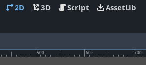
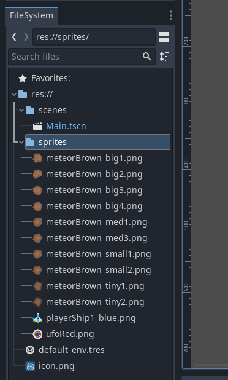
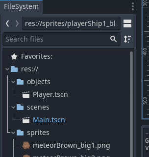
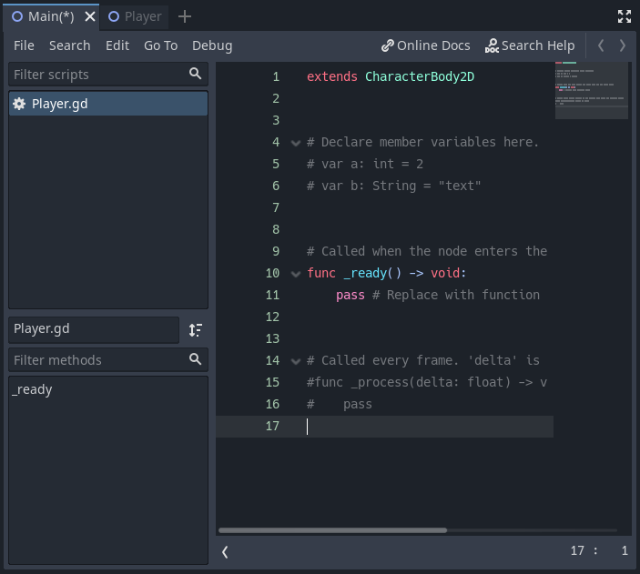

# Godot - Asteroids Game For Complete Beginners: 1

## Warning, this article is still in development! Do not use for learning yet!

## Introduction

This tutorial is designed for people with little to no experience with 
programming who want to learn how to create games using the Godot game engine.

This article will cover:

1. How to setup Godot.
2. How to use the editor on a very basic level.
3. How to write a simple gameplay.

This article will not cover how to write a full/complex game, in order to do
that, you need to know the basics. The game will be 2D as that is the easiest
type of game for beginners to understand. At this level, the third dimension
adds an extra layer of complexity that is unnecessary.

**This tutorial was developed using Linux, this shouldn't be a problem most of
the time as Godot is mostly platform independent, if there's different ways
of doing the same thing depending on the OS currently running, then there will
be instructions for Windows and MacOS also included, but they may be inaccurate.
If you find any mistakes then email me for a correction.**

## Setup

### Downloading Godot

Downloading Godot is very easy, it is a standalone executable so all that is
required is heading over to the [Godot](https://godotengine.org/download)
website's downloads page and downloading it.

While you're there, notice that there's a 
[learn](https://docs.godotengine.org/en/stable/) tab that takes you to the
documentation of the engine written by the engine developers. You currently
might not be able to fully understand some or all of the things there, if you
do not, then this tutorial will help you do so.

_The tutorial is currently designed for Godot version 4.0 as that is the
latest version of Godot. Versions earlier than 4.0 are not compatible with
this tutorial as there have been a lot of changes since the 3.XX versions.
Versions succeeding 4.0 may still be compatible with this tutorial as 4.XX
likely won't break any compatibility._

### Creating a New Project

Once Godot is running, you will be greeted by the project manager. Godot
allows you to work on multiple projects, here is where you can manage them.
The window is divided into two sections, the section on the left is the
list of projects that are currently on your computer. If this is
your first time using Godot, then the list on the left should be blank. The
list on the right is for managing those projects, each button allows for
a different action. Currently click on the button with the text "New Project".

The project creation window should now appear. The top text box labeled
"Project Name" should allow you to name your project. The text box below that
labeled "Project Path" allows you to select a location to where the project
will be saved upon creation. Godot only lets you create a project in an empty
folder, so if you pick a folder that is not empty, you can click the 
"Create Folder" button to create an empty folder to place your project in.
There are more options in this dialog box, but for now, they are not necessary.
When you are finished, click on the "Create & Edit" button to create your
new project.

## Editor Basics

The editor should appear upon creating your new project. The image below shows
the editor once it has launched with a newly created project.

In the center of the scene you can see your viewport, it is the large window
that is displaying the 3D grid. In this tutorial, we will be making a 2D game,
so let's switch to the 2D view by clicking on the 2D button at the top of the
viewport. Alongside it are other buttons, 2D, 3D, Script and AssetLib. For now
we will be in 2D mode, however, we will go over what all the other buttons do
aside from the 3D mode button.

You will notice that the viewport has now changed, instead of a 3D grid,
there's now a 2D gray surface instead, this is the 2D viewport. Also notice 
there are some other panels aside from the viewport. Each panel in the editor
serves an important purpose. We will cover what they do later, but for now,
click on the _2D Scene_ button on the _Scene_ tab. Doing that will cause the
_2D Scene_, _3D Scene_, _User Interface_ and _Other Node_ buttons to disappear
and be replaced by a list with only one populated item named _Node2D_.

The panel that this list is inside of is called the _Scene_ tab, it
lists all of the nodes that are added into the scene. For now, think of
nodes as objects that exist in the scene. As you can see, there is one
node called Node2D added.

Let's save this empty scene we have created, we will slowly create our game
in this scene. Press `ctrl+s` to bring up the save dialog or go to
`Scene->Save Scene` at the top menu bar. Select a location to save the scene
to in your project tree. It is important to be organized when developing
games as it increases productivity, makes your project more readable and
understandable especially when you or someone else looks at it later on.

Create an empty folder using the _Create Folder_ button at the top right.
Name it _scenes_, then save the current scene as _Main.tscn_. If you look
at the bottom left of the editor window now, in the panel called _FileSystem_,
you now see the newly created _scene_ folder, clicking the arrow next to it
will expand it revealing the _Main.tscn_ scene that we have just saved.

The _FileSystem_ panel allows us to view all the assets and resources that
are accessible to our project. Now that we have a scene saved, we can run
the project. At the top right corner of the editor window, there are five
buttons, _Play_, _Pause_, _Stop_, _Play Scene_, _Play Custom Scene_.

All these buttons allow us to run the game, pause it, and stop it from running.
Press the _Play_ button, which is the left-most button in the list.
A dialog should popup, Godot doesn't know what scene it should launch the game
with, click on _Select Current_ to set the currently open scene as the starting
scene, alternatively, selecting _Select_ will bring up the file select dialog
to select a scene manually. Either way, select the _Main.tscn_ scene we have
just saved. A blank window should pop up now. That is the game running!
Currently it's not doing much, but that is because we haven't told it to do
anything yet. We need to first import some assets so we can start making
a simple game.

### Importing Assets

Importing assets allows us to use said assets in our project. Assets can
be anything, in this instance, we will import some game sprites so we can
have a character in our game, some enemies, and some items.

There are three ways to import assets:

1. Drag the file into the folder you want to import it in in the _FileSystem_
panel.
2. The second is to copy the files into your project directory through your
operating system's file manager, Godot will automatically recognize and import
the assets.
3. The third is by using the _AssetLib_ mode on the editor window. Recall the
_2D_, _3D_, _Script_, and _AssetLib_ buttons at the top area of the editor.
We were in _2D_ mode, click on _AssetLib_ to switch to _AssetLib_ mode.

Switching to _AssetLib_ mode changes once more the viewport, now it is shows
a list of assets that we can import for free into our project! All these
assets can also be found on the Godot website's 
[Asset](https://godotengine.org/asset-library/asset) page.

The 2D sprite pack we want however can be found
[here](https://opengameart.org/content/space-shooter-redux). We will manually
import this art into the engine and use it, as we are making a 2D space shooter
game. Right click on the _res://_ folder on the _FileSystem_ panel on the bottom
left, then select _New Folder_, name the new folder _sprites_. Extract the
zipped content pack and drag the following sprites from the downloaded asset
pack into the sprites folder:

* PNG/Meteors/meteorBrown_big1.png
* PNG/Meteors/meteorBrown_big2.png
* PNG/Meteors/meteorBrown_big3.png
* PNG/Meteors/meteorBrown_big4.png
* PNG/Meteors/meteorBrown_med1.png
* PNG/Meteors/meteorBrown_med3.png
* PNG/Meteors/meteorBrown_small1.png
* PNG/Meteors/meteorBrown_small2.png
* PNG/Meteors/meteorBrown_tiny1.png
* PNG/Meteors/meteorBrown_tiny2.png
* PNG/playerShip1_blue.png
* PNG/ufoRed.png

After importing the sprites into the project, the _FileSystem_ should look
like this:

The assets just imported can now be used in our project. It is important to
understand the node system that Godot has in place before we continue, in the
next section, the node system will be briefly introduced.

### The Node System

Nodes are fundamental to Godot, they are used for creating creating each element
of a game. The Node2D created in our _Main.tscn_ is in fact a node. What makes
nodes so special is the fact that they can be a child or a parent of another
node. Right click on _Node2D_ in the _Scene_ panel and click on _Rename_.
Rename it to _Main_ so it matches the name we chose when we saved the scene
node in our _FileSystem_.

We can drag the sprites we imported into our viewport, they will be added
into our scene as children of _Main_. The sprites added into our scene will
actually be added as _Sprite2D_ nodes. Clicking on one of the sprites in the
_Scene_ panel changes the panel on the right side of the editor window
named _Inspector_. The _Inspector_ panel shows all the properties of the
currently selected node.

We can see the _Sprite2D_ node has a property called _Texture_ that references
the sprite in our project, that is how it is able to be shown as a node.

## Creating the Player Ship

We will now create our a character that can shoot bullets and break those
meteors that we have placed. Create a new folder in the _FileSystem_ called
_objects_. Our player will indeed be a node, the player node will have some
behavior attached to it that will allow it to be controlled by us. We will
save the player and behavior as a separate scene inside of the objects folder.
It is worth noting that scenes are nodes that are saved into the file system.

At the top left menu of the editor window, click `Scenes->New Scene`. A new
tab in our viewport will have appeared now. This tab shows an empty scene
similar to how the viewport was before we created the _Main_ scene and saved it.

Click on the _2D Scene_ button in the _Scene_ panel to create another _Node2D_
which are the basic building blocks of a 2D game. Rename the node to _Player_.
We will now add the _playerShip1_blue.png_ sprite that we have imported
previously as a child _Sprite2D_ node to the root _Node2D_ node. This can be
done by dragging the sprite from the _FileSystem_ to the viewport like before.
You will notice the ship is added as a child of the _Player_ node in the
scene panel.

It is a good time to save the scene we have just created into the _objects_
folder in our file system. You will notice that Godot has automatically chosen
the name _Player.tscn_ for our scene, this is because the root node is named
_Player_.

We can now drag the Player object into the Main scene we had created before.
If we run the game now, we can see the meteors and our player ship, however,
we cannot do anything yet because we have not programmed anything in the game
yet. In the next section, we will program some basic behavior and attach
it to the player scene.

## Programming Basics

**It is recommended you take a break at this part of the tutorial**

The base version of Godot has 3 ways of adding behavior to objects:

* GDScript: Writing code in Godot's own scripting language.
* VisualScript: Visual scripting, drag and drop blocks.
* NativeScript: Writing code in C++ - advanced and out of scope.

In this tutorial we will be using GDScript. The scripts we create are
going to be stored in the file system, create a new folder in the _res://_
folder called _code_. Right click in the newly created _code_ folder and
select _New Script_. The new script dialog will appear, there are a couple
of options that need to be changed:

* Set the language to _GDScript_.
* Set the _Inherits_ text box to `CharacterBody2D`.
* Change the path of the script to `res://code/Player.gd`.
* Click on _Create_ to create the script.

Double click on the newly created file in the file system to switch to the
scripting mode in editor. The viewport will now be replaced with the script
editor. In the center there is a text field you type your GDScript code.
On the top left of the viewport, you have a list of currently open scripts.
On the bottom left you have a summary of your currently opened file's code,
it will currently be empty with just `_ready` being visible. On the right of
the code editor, there is an overview map of the text in the code.

The grayed out text are comments, comments are created by using the `#`, 
anything to the right side of `#` will be a comment. It will not be processed
by Godot, you can use this to write comments about your code for documentation
and readability purposes.

Each node in Godot has a set of pre-made methods that can be extended in
scripts. A method in programming a series of instructions that the computer will
follow when told so. Methods and functions will be used interchangeably in this
tutorial, there is a small difference between them in reality, however, this
difference does not apply in Godot. Methods can take a series of pre-defined
inputs, and can also output a value back to the statement that had invoked the
method. These pre-made methods are invoked at specific times, for example the
`_physics_process` method is called at a constant rate every second. So it is
good for writing behavior that is continuous. We will be extending this method
in order to make the player ship rotate.

The code for the player ship script (it is responsible for rotating the ship):

    extends CharacterBody2D

    @export var turn_speed : float = 3 

    func _physics_process(delta: float) -> void:
        var move_dir : int = 0
        
        # If left is pressed, then move direction will be set to -1
        if Input.is_key_pressed(KEY_LEFT):
            move_dir = -turn_speed
        
        # If right is pressed, then move direction will be set to 1.
        if Input.is_key_pressed(KEY_RIGHT):
            move_dir = turn_speed
            
        # We now rotate the ship left or right depending on if move_dir is a
        # positive or negative number.
        rotate(move_dir * delta)
    
    

The `func _physics_process(delta: float) -> void:` is a method declaration, also
known as a function declaration. The node that this script extends,
`CharacterBody2D` has this `_physics_process` method already defined, this
allows us to implicitly override that method and so, when the method in the base
class is invoked, it will call the method in the Player script instead. As can
be seen, the `_physics_process` method takes a `float` as an input, a float is
basically a number that can have decimal points. The inputs to the function are
called _parameters_ and they are defined all inside the brackets at the top of
the function declaration (called the function header). The `-> void` denotes
that this function is _void of output_. This means that it will not return any
type of value back to the caller.

So any code we write in the `_physics_process` method will be called at a
constant rate every second. This means that we can write code to rotate the ship
by a tiny amount every time and it will appear as if the ship was rotating
smoothly over time. We declare a variable called `move_dir` first, it will hold
a number as can be seen by the `int` keyword, and we assign the value `0`
initially to it. We then have two `if` statements, an `if` statement allows for
a question to be asked in code, in this case, Godot has a function we can call,
that returns a value of type `bool`, `bool` values either be `true` or `false`.
The `if` statement, looks at the `bool` value, and if it is `true` it will
execute the code that is indented underneath the `if` statement in question.

The two functions used in each if statement, `Input.is_key_pressed` are only
true if the value passed to them, `KEY_LEFT` or `KEY_RIGHT` are pressed. So,
if the left key is pressed, then the variable `move_dir` will be set to `-1`. If
the right key is pressed, then 1 will be added to `move_dir`. The final
statement `rotate` rotates the player ship by whatever radians you supply to it.
So if `move_dir` is `-1` it will rotate counter-clockwise, if `move_dir` is `1`,
then it will rotate clockwise. Before we pass it `move_dir`, we multiply it
with `delta` because that allows it to move at constant speed, regardless of
how many FPS the game is running with.

We have now completed the script that when attached to the _Player_ node will
cause it to rotate. However, the Player node cannot accept the script in its
current form, recall the first line in the Player script; `extends
CharacterBody2D`, this line allows the Player script to use functions that will
rotate the player ship, however, the player ship is not a CharacterBody2D node,
it is a Node2D. The root node of the Player scene needs to be converted into
a CharacterBody2D node first before it can be attached without any errors
appearing. Doing so is very simple, open the _Player.tscn_ scene, and right
click the root node that we have previously named _Player_ and select
_Change Type_, from the dialog that appears, select _CharacterBody2D_, the
type of the root node of _Player.tscn_ is now a _CharacterBody2D_.

You will notice that a yellow warning signal has appeared next to the name root
node's name, hovering over it will reveal why the warning is there.

> Node configuration warning:
>
> * This node has no shape, so it can't collide or interact with other objects.
>
> Consider adding a CollisionShape2D or CollisionPolygon2D as a child to define
> its shape.

This warning is self evident, we need to add either a CollisionShape2D or a
CollisionPolygon2D node as a child of the root node in order to define
which region of the player is solid. Right click on the _Player_ node and
select _Add Child Node_, in the dialog that shows up, select _CollisionShape2D_
as the type of the new node to add. Once it is added, a new warning should
appear, this time next to the newly added node's name.

> Node configuration warning:
>
> * A shape must be provided for CollisionShape2D to function. Please create a
> shape resource for it.

While nodes in Godot serve a functional purpose, resources function as data
containers. They don't have a functional purpose themselves, instead they are
used by nodes as data. So CollisionShape2D wants a resources that describes
what shape it shall have. Resources are added from the _Inspector_ panel. While
having the _CollisionShape2D_ node selected, the inspector panel will look like
this:

Notice that the _Shape_ property is marked as `[empty]`, this is the property
that the warning was describing, it needs a shape assigned to it, click on the
`[empty]` text, a menu will appear allowing you to select from a wide variety
of shapes. Select _CircleShape2D_ as the shape. A small circle will appear at
coordinates (0, 0) in the _Player.tscn_ scene. Depending on the player ship
sprite was placed, it is most likely that the shape will not overlap the ship.
It is vital we center the ship to (0,0) as this will solve a lot of issues that
would have appeared in the future. You can either drag the ship sprite to the
origin coordinate (0,0) or set the coordinates to 0 through the inspector in
`Transform->Position`.

Select the collision shape again and click on the `CircleShape2D` resource in
the inspector that has replaced the `[empty]` value. The property should now
expand, revealing all the parameters that can be edited to customize the
circle shape. Increasing the _Radius_ property to 40 covers most of the ship,
this is how the editor should look like after the change:

It is time to assign the script we have created previously to the _Player_ node,
drag the script from the _FileSystem_ to the _Player_ node. Once done, a little
scroll icon will appear next to the name, when clicked, it will open the script
in the script editor mode.

## Running The Game

Pressing the `F5` key or clicking on the _Play_ button at the top right of the
editor window will run the game. If all went correctly, you should see the
meteors we placed down previously, along with the player ship. Pressing the
left or right keys will cause it to rotate clockwise and counter-clockwise.

### Getting Help

Godot's scripting editor has a useful feature that allows you to search for help
regarding all of Godot's types. Notice in the top right corner of the script
editor, there is a button labeled _Search Help_, when clicked, a dialog will be
revealed allowing you to search and view information on the type you are
interested in, here is help regarding the float type that the `_physics_process`
method took:

## Project Files

The project files for this tutorial can be accessed on
[GitHub](https://github.com/Yiannis128/godot-asteroids/tree/part-1). You can use
these files as reference material if you get stuck while following the tutorial.

## What's Next

Part 2 of the tutorial series can be accessed [here](godot-asteroids-02.html).
It is recommended that at some point you check the useful links section in order
to get a better understanding of some of the concepts that appeard in this
article.

## Useful Links

Here are some Godot documentation pages which describe some of the topics that
we have explored today. It is highly recommended you read them when you are
ready as this tutorial does not explain the way the underlying systems work in
Godot, that is not the goal. The goal of this tutorial is to get beginners
introduced into the engine and get them to a point where they are comfortable
enough to explore and learn by themselves. It would be impossible to create a
tutorial that fully explains every aspect of game creation and Godot while at
the same time being able to be completed in about an hour.

1. [Introduction to Godot's editor](https://docs.godotengine.org/en/stable/getting_started/step_by_step/intro_to_the_editor_interface.html)
2. [Scenes and nodes](https://docs.godotengine.org/en/stable/getting_started/step_by_step/scenes_and_nodes.html)
3. [File system](https://docs.godotengine.org/en/stable/getting_started/step_by_step/filesystem.html)
4. [Scripting](https://docs.godotengine.org/en/stable/getting_started/step_by_step/scripting.html)
5. [Object-Oriented Programming](https://en.wikipedia.org/wiki/Object-oriented_programming)
6. [Your first game](https://docs.godotengine.org/en/stable/getting_started/step_by_step/your_first_game.html)
