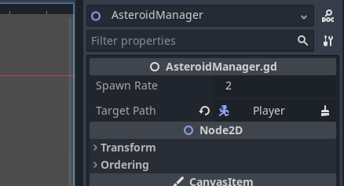
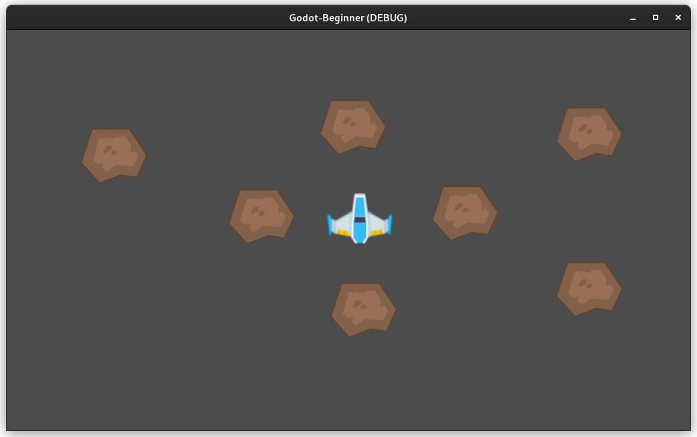

params
title: Godot - Asteroids Game For Complete Beginners: 4
category: Godot - For Complete Beginners
endparams

## Warning, this article is being proof-read! Proceed with caution.

### [Previous Article: Godot Asteroids Tutorial - Part 3](godot-asteroids-03.html)

## Introduction

This is part 4 of the tutorial series for making an asteroids style game in
Godot, designed for absolute beginners with little to no experience in
programming.

This article will cover:

1. How to make the asteroids slowly move towards the player ship.
2. How to make the asteroids spawn around the player ship.

Before going through this article, it is recommended following the steps
outlined in the previous parts of this tutorial series.

### Moving the Asteroids

This section will cover how to make the asteroids move towards the player ship.
Begin, by opening the asteroid script (`code/Asteroid.gd`). The additional
script variable will need to be declared:

    var move_dir : Vector2 = Vector2.ZERO

The `move_dir` variable will tell the asteroid which direction to move. When the
asteroid is spawned, it will be set to move towards the player ship. Along, with
the variable comes this method:

    func _physics_process(delta: float) -> void:
        position += move_dir * delta

In the asteroid's physics process method, the position is updated by delta
multiplied with the `move_dir` variable we set earlier. The `move_dir`
variable's default value is `Vector2.ZERO`, this will make the default state of
the asteroid stationary. So the asteroids placed manually will not move.

### Spawning Asteroids

In order to make the asteroids spawn around the player ship randomly, we can
create and use a dedicated node that will be responsible for selecting a random
position outside of the screen, spawing an asteroid node, and then setting it's
`move_dir` to point to the ship. Create a new script in the `code` folder with
the name `AsteroidManager.gd` that will inherit from `Node`. Additionally create
a new 2D scene like with all the previous nodes. Name the root node as
`AsteroidManager` and save it at `objects/AsteroidManager.tscn`. Additionally,
attach the script to the root node, by dragging it from the FileSystem panel to
the root node in the Scene panel. Open the `AsteroidManager.gd` script and edit
it so that it contains the following code:

    extends Node

    @export var spawn_rate : float = 2
    var spawn_rate_left : float = 0

    @export_node_path(Node) var target_path : NodePath = ""
    var target : Node = null

    var asteroid_scene : PackedScene = preload("res://objects/Asteroid.tscn")
    var asteroid_speed : float = 150
    var spawn_distance_offset : float = 500

    func _ready() -> void:
        randomize()
        spawn_rate_left = spawn_rate
        target = get_node_or_null(target_path)

    func _process(delta : float) -> void:
        if target == null:
            return

        # If spawn_rate_left hits 0, then spawn an asteroid, and reset the timer.
        if spawn_rate_left <= 0:
            spawn_asteroid()
            spawn_rate_left = spawn_rate
        
        # If the spawn_rate_left is higher than 0, then decrement it.
        if spawn_rate_left > 0:
            spawn_rate_left -= delta

    func get_new_asteroid_position() -> Vector2:
        # Get the size of the screen.
        var size : Vector2 = get_viewport().size
        
        var rand_ang : float = randf_range(0, 2 * PI)
        var center : Vector2 = size / 2
        
        var spawn_offset : Vector2 = Vector2.RIGHT.rotated(rand_ang) * spawn_distance_offset
        var spawn_location : Vector2 = center + spawn_offset
        
        return spawn_location

    func spawn_asteroid() -> void:
        if target == null:
            return

        # Spawn the asteroid.
        var asteroid : Node = asteroid_scene.instantiate()
        
        # Find a random position to spawn the asteroid to.
        asteroid.position = get_new_asteroid_position()
        
        # Set the asteroid move_dir towards target.
        var offset : Vector2 = target.position - asteroid.position
        asteroid.move_dir = offset.normalized() * asteroid_speed
        
        # Add the asteroid to the scene.
        add_sibling(asteroid) 

Perhaps this is the longest script in the entire project, however, when broken
down, it is simple to understand. The following script variables are declared:

* `@export var spawn_rate : float = 2`: This is the value that `spawn_rate_left`
  will be set to when a new asteroid is created.
* `var spawn_rate_left : float = 0`: This variable represents a timer, when it
  reaches `0`, the _AsteroidManager_ will spawn an asteroid, then this value
  will be set back to `spawn_rate` and the process will begin again.
* `@export_node_path(Node) var target_path : NodePath = ""`: The target path
  holds a value which allows us to get the target. This value can be set from
  the Inspector panel when the _AsteroidManager_ node is selected.
* `var target : Node = null`: This represents the target that this
  _AsteroidManager_ will direct the asteroids to, in this case it is the player
  ship, this will be initialized using the `target_path` variable that will be
  set from the Inspector panel.
* `var asteroid_scene : PackedScene = preload("res://objects/Asteroid.tscn")`: 
* `var asteroid_speed : float = 150`: How fast the asteroids will move when
  spawned.
* `var spawn_distance_offset : float = 500`: This controls how far from the
  center of the screen the asteroids will spawn.

The `_ready` method is the smallest and simplest method in the entire script, it
first calls `randomize` which is a built-in method that causes all calls to
functions that return random numbers back to be truly random. It then sets
`spawn_rate_left` to the value of `spawn_rate` so that a asteroid doesn't
immediatley spawn (allowing the player to prepare). Finally, it calls the
built-in function `get_node_or_null` passing the `target_path` variable as a
parameter, this function returns a reference to the object that `target_path`
points to, which in practise, will be the player ship. So an easy way to
understand this is (although it is a little bit more complicated than this),
`target_path` points to the player ship and `target` is the player ship.

The `_process` method starts by first checking if `target` has not been set in
the `_ready` method, then exits the method, this is because the game will crash
if we attempt to use `target` for anything if it is set to `null`, which it will
be unless changed in the `_ready` method. If it is `null`, then it is because
`target_path` is not pointing to the ship. The rest of the method is very
similar to the `_process` method of the player ship script, as it is another
timer. This time the purpose of the timer is to countdown and when it reaches
`0`, it will spawn an asteroid by calling the `spawn_asteroid` method.

The `_spawn_asteroid` method checks like the `_process` method if `target` is
`null` and exits the method if it is because it uses the `target` variable to
tell the asteroids to target it. It first calls the `instantiate` method on the
`asteroid_scene` variable, as the variable is a _PackedScene_ which means that
it holds all the information on how to create a new asteroid. The newly created
asteroid is assigned to the `asteroid` variable. The asteroid's position is then
set to the `Vector2` that the function `get_new_asteroid_position` returns. This
method will be covered later. The variable `offset` is then assigned the value
representing the difference in positon between the target and the asteroid. This
value is then [normalized](http://www.fundza.com/vectors/normalize/) and
assigned to the `move_dir` of the asteroid (the script variable that we created
earlier when making the asteroid). The asteroid is added to the scene by calling
the `add_sibling` method.

The `get_new_asteroid_position` method is perhaps the most difficult to
understand due to its heavy use of vector maths. It begins by assigning size the
value obtained by calling `get_viewport().size`, `size` is a variable that
belongs to a `Viewport` object obtained by calling `get_viewport()`. This
represents the width and height of the window. The idea is to select a position
outside of the viewport. The value returned by the function `randf_range` is
assigned to `rand_ang`, this function will return a random value in the range of
`0` and `2π` (`π` is being represented by PI in GDScript). This will represent a
random direction to spawn the asteroid in. The center of the viewport, that is,
the center of the screen is assigned to center. 

Then the spawn location is obtained through two steps. Firstly, the
`spawn_offset` is calculated which is the direction from the center of the
screen that the asteroid will spawn from. This is done by calling the `rotated`
method on the constant _Vector2_ value called `Vector2.RIGHT` which is
equivalent to typing `Vector2(1, 0)`. The `rotated` method is passed the random
angle number that was calculated previously. The result is then multiplied by
the variable `spawn_distance_offset`. This effectively gets a random direction
away from the coordinates `(0,0)`, the next step translates those coordinates to
the center of the screen. `spawn_offset` is added to `center`. The result is
then returned by the function. _This method may be a bit hard to understand,
it is not necessary to understand it on the first read, perhaps it is worth
revisiting this article in a few days_.

Before starting the game, it is important to remember to place the
_AsteroidManager_ objects in the level first, drag and drop it from the
FileSystem panel, it doesn't matter where as it is invisible, doesn't interact
with any objects, and does not use it's position for anything. It is also
critical that the `target_path` variable is set, this can be done by selecting
the _AsteroidManager_ node placed in the scene (either through the Scene panel
or through the viewport), once selected, the Inspector will reveal all the
Node's properties. As observed, the `target_path` variable created in the script
is now exposed in the inspector allowing us to set it. When clicked, we can then
select the player ship as the target.

After all this, running the game will show that the asteroids are being spawned
now and are targeting the player.

## Project Files

The project files for this tutorial can be accessed on
[GitHub](https://github.com/Yiannis128/godot-asteroids/tree/part-3). You can use
these files as reference material if you get stuck while following the tutorial.

## Useful Links

1. [GDScript Exports](https://docs.godotengine.org/en/stable/getting_started/scripting/gdscript/gdscript_exports.html)

## What's Next

Part 4 covered a lot of topics that may not have been fully explained, it is
recommended that you read the articles in Useful Links in order to better
understand them before moving to Part 5.

### [Next Article: Godot Asteroids Tutorial - Part 5](godot-asteroids-05.html)
