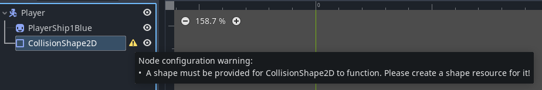
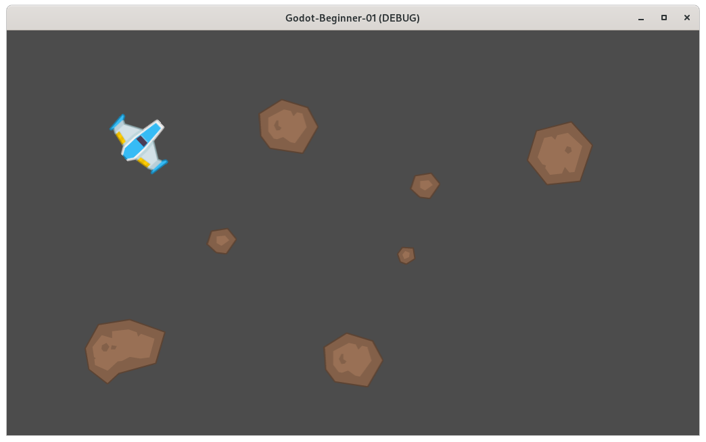

## Introduction

This is part 2 of the tutorial series for making an asteroids style game in
Godot, designed for absolute beginners with little to no experience in
programming.

This article will cover:

1. Basics of programming.
2. Programming in Godot.
3. How to write simple gameplay.

## Programming Basics

The base version of Godot has 3 ways of adding behavior to objects:

* GDScript: Writing code in Godot's own scripting language.
* VisualScript: Visual scripting, drag and drop blocks.
* NativeScript: Writing code in C++ - advanced and out of scope.

In this tutorial we will be using GDScript. The scripts we create are
going to be stored in the file system, create a new folder in the "res://"
folder called "code". Right click in the newly created "code" folder and
select "New Script". The new script dialog will appear, there are a couple
of options that need to be changed:

* Set the language to _GDScript_.
* Set the _Inherits_ text box to `CharacterBody2D`.
* Change the path of the script to `res://code/Player.gd`.
* Click on _Create_ to create the script.

Double click on the newly created file in the file system to switch to the
scripting mode in editor. The viewport will now be replaced with the script
editor. In the center there is a text field you type your GDScript code.
On the top left of the viewport, you have a list of currently open scripts.
On the bottom left you have a summary of your currently opened file's code,
it will currently be empty with just `_ready` being visible. On the right of
the code editor, there is an overview map of the text in the code.

The grayed out text are comments, comments are created by using the `#`, 
anything to the right side of `#` will be a comment. It will not be processed
by Godot, you can use this to write comments about your code for documentation
and readability purposes.

Each node in Godot has a set of pre-made methods that can be extended in
scripts. A method in programming a series of instructions that the computer will
follow when told so. The name method and function will be used interchangeably
in this tutorial, there is a small difference between them in reality, however,
this difference does not apply in Godot. Methods can take a series of
pre-defined inputs, and can also output a value back to the statement that had
invoked the method. These pre-made methods are invoked at specific times, for
example the `_physics_process` method is called at a constant rate every second.
So it is good for writing behavior that is continuous. We will be extending this
method in order to make the player ship rotate.

The code for the player ship script (it is responsible for rotating the ship):

    extends CharacterBody2D

    @export var turn_speed : float = 3 

    func _physics_process(delta: float) -> void:
        var move_dir : int = 0
        
        # If left is pressed, then move direction will be set to -1
        if Input.is_key_pressed(KEY_LEFT):
            move_dir = -turn_speed
        
        # If right is pressed, then move direction will be set to 1.
        if Input.is_key_pressed(KEY_RIGHT):
            move_dir = turn_speed
            
        # We now rotate the ship left or right depending on if move_dir is a
        # positive or negative number.
        rotate(move_dir * delta)
    
The `func _physics_process(delta: float) -> void:` is a method declaration, also
known as a function declaration. The node that this script extends,
`CharacterBody2D` has this `_physics_process` method already defined, this
allows us to implicitly override that method and so, when the method in the base
class is invoked, it will call the method in the Player script instead.

As can be seen, the `_physics_process` method takes a `float` as an input, a
float is basically a number that can have decimal points. The inputs to the
function are called _parameters_ and they are defined all inside the brackets at
the top of the function declaration (called the function header). The `-> void`
denotes that this function is _void of output_. This means that it will not
return any type of value back to the caller.

So any code we write in the `_physics_process` method will be called at a
constant rate every second. This means that we can write code to rotate the ship
by a tiny amount every time and it will appear as if the ship was rotating
smoothly over time. We declare a variable called `move_dir` first, it will hold
a number as can be seen by the `int` keyword, and we assign the value `0`
initially to it. We then have two `if` statements, an `if` statement allows for
a question to be asked in code, in this case, Godot has a function we can call,
that returns a value of type `bool`. `bool` values can either be `true` or
`false`. The `if` statement, looks at the `bool` value, and if it is `true` it
will execute the code that is indented underneath the `if` statement in
question.

The two functions used in each if statement, `Input.is_key_pressed` are only
true if the value passed to them, `KEY_LEFT` or `KEY_RIGHT` is pressed. So, if
the left key is pressed, then the variable `move_dir` will be set to `-1`. If
the right key is pressed, then 1 will be added to `move_dir`. The final
statement `rotate` rotates the player ship by whatever radians you supply to it.
So if `move_dir` is `-1` it will rotate counter-clockwise, if `move_dir` is `1`,
then it will rotate clockwise. Before we pass it `move_dir`, we multiply it with
`delta` because that allows it to move at constant speed, regardless of how many
FPS the game is running with.

We have now completed the script that when attached to the _Player_ node will
cause it to rotate. However, the Player node cannot accept the script in its
current form, recall the first line in the Player script; `extends
CharacterBody2D`, this line allows the Player script to use functions that will
rotate the player ship, however, the player ship is not a CharacterBody2D node,
it is a Node2D. The root node of the Player scene needs to be converted into
a CharacterBody2D node first before it can be attached without any errors
appearing. Doing so is very simple, open the _Player.tscn_ scene, and right
click the root node that we have previously named _Player_ and select
_Change Type_, from the dialog that appears, select _CharacterBody2D_, the
type of the root node of _Player.tscn_ is now a _CharacterBody2D_.

You will notice that a yellow warning signal has appeared next to the name root
node's name, hovering over it will reveal why the warning is there.

> Node configuration warning:
>
> * This node has no shape, so it can't collide or interact with other objects.
>
> Consider adding a CollisionShape2D or CollisionPolygon2D as a child to define
> its shape.

This warning is self evident, we need to add either a CollisionShape2D or a
CollisionPolygon2D node as a child of the root node in order to define
which region of the player is solid. Right click on the _Player_ node and
select _Add Child Node_, in the dialog that shows up, select _CollisionShape2D_
as the type of the new node to add. Once it is added, a new warning should
appear, this time next to the newly added node's name.

> Node configuration warning:
>
> * A shape must be provided for CollisionShape2D to function. Please create a
> shape resource for it.

While nodes in Godot serve a functional purpose, resources function as data
containers. They don't have a functional purpose themselves, instead they are
used by nodes as data. So CollisionShape2D wants a resources that describes
what shape it shall have. Resources are added from the _Inspector_ panel. While
having the _CollisionShape2D_ node selected, the inspector panel will look like
this:

Notice that the _Shape_ property is marked as `[empty]`, this is the property
that the warning was describing, it needs a shape assigned to it. Click on the
`[empty]` text, a menu will appear allowing you to select from a wide variety of
shapes. Select _CircleShape2D_ as the shape. A small circle will appear at
coordinates (0, 0) in the _Player.tscn_ scene. Depending on the player ship
sprite was placed, it is most likely that the shape will not overlap the ship.
It is vital we center the ship to (0,0) as this will solve a lot of issues that
would have appeared in the future. You can either drag the ship sprite to the
origin coordinate (0,0) or set the coordinates to 0 through the inspector in
`Transform->Position`.

Select the collision shape again and click on the `CircleShape2D` resource in
the inspector that has replaced the `[empty]` value. The property should now
expand, revealing all the parameters that can be edited to customize the circle
shape. Increasing the _Radius_ property to 40 covers most of the ship, this is
how the editor should look like after the change:

It is time to assign the script we have created previously to the _Player_ node,
drag the script from the _FileSystem_ to the _Player_ node. Once done, a little
scroll icon will appear next to the name, when clicked, it will open the script
in the script editor mode.

## Running The Game

Pressing the `F5` key or clicking on the _Play_ button at the top right of the
editor window will run the game. If all went correctly, you should see the
meteors we placed down previously, along with the player ship. Pressing the
left or right keys will cause it to rotate clockwise and counter-clockwise.

### Getting Help

Godot's scripting editor has a useful feature that allows you to search for help
regarding all of Godot's types. Notice in the top right corner of the script
editor, there is a button labeled _Search Help_, when clicked, a dialog will be
revealed allowing you to search and view information on the type you are
interested in, here is help regarding the float type that the `_physics_process`
method took:

## Project Files

The project files for this tutorial can be accessed on
[GitHub](https://github.com/Yiannis128/godot-asteroids/tree/part-1). You can use
these files as reference material if you get stuck while following the tutorial.

## Useful Links

1. [Scripting](https://docs.godotengine.org/en/stable/getting_started/step_by_step/scripting.html)
2. [Object-Oriented Programming](https://en.wikipedia.org/wiki/Object-oriented_programming)
3. [Your first game](https://docs.godotengine.org/en/stable/getting_started/step_by_step/your_first_game.html)

## What's Next

It is recommended that at some point you check the useful links section in order
to get a better understanding of some of the concepts that appeard in this
article. Also, check out part 3 of the tutorial series.
