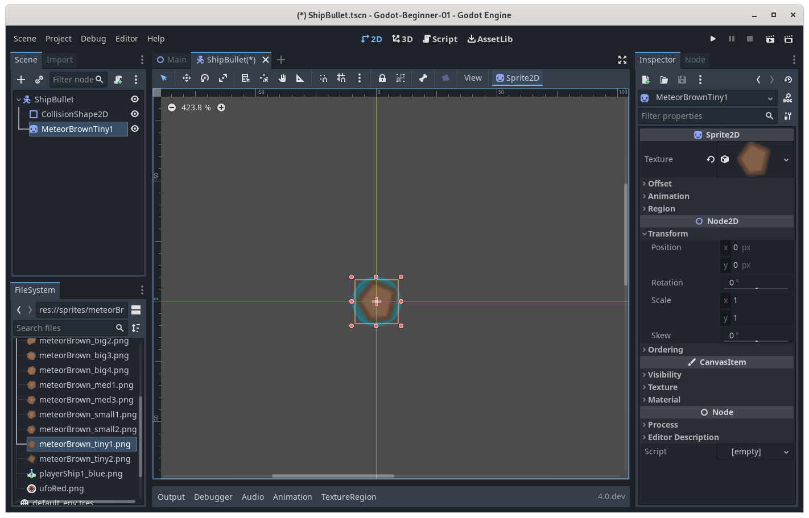

### [Previous Article: Godot Asteroids Tutorial - Part 2](godot-asteroids-02.html)

## Introduction

This is part 3 of the tutorial series for making an asteroids style game in
Godot, designed for absolute beginners with little to no experience in
programming.

This article will cover:

1. Creating bullets for the player ship.
2. How to make the player ship shoot bullets.
3. Making the asteroids break when hit by the bullets.

Before going through this article, it is recommended following the steps
outlined in [part 1](godot-asteroids-01.html) of this tutorial series.

## The Bullet Scene

First start by creating a new scene; `Scene->New Scene` at the top menu bar,
this scene will be used to represent a single bullet. Once the new scene is
created, in the Scene panel, create a `2D Scene`. Rename the root node from
"Node2D" to "ShipBullet" and save the scene into the objects folder in the
project files. Change the root node's type to "Area2D", this is because, while
the bullet will move, we will only change the position of the bullet and check
if it overlaps with any asteroids, and Area2D is a good candidate for this.
Proceed to add a new node as a child of type `CollisionShape2D`. In the
Inspector panel, click on the `[empty]` value of the shape property and assign
a _New CircleShape2D_.

From the _FileSystem_ panel, in _sprites_ folder, drag the 
_meteorBrown\_tiny1.png_ into the scene to use as the sprite for the bullet.
Like before, make sure to center it to the origin of the scene so it overlaps
with the CollisionShape2D.

## The Bullet Code

It is time to create a script that will cause the bullet to move forward, along
with assigning it to the scene. In the FileSystem panel, right click the _code_
folder and click on _New Script_, name it `ShipBullet.gd`. Make sure it inherits
`Area2D`. Drag and drop the newly created script from the FileSystem panel to
the _ShipBullet_ root node in the Scene panel.

In FileSystem, double-click the script to open it. The ship bullet code should
look like this:

    extends Area2D

    var speed : float = 500

    # Called every frame. 'delta' is the elapsed time since the previous frame.
    func _process(delta: float) -> void:
        position += Vector2(speed * delta, 0).rotated(rotation)

This code will cause the bullet to move forward, the `_process` function will be
called repeatedly, and so, the position of the ship will be updated from its
previous value to 500 pixels forward every second. `position` is a built-in
property of Area2D along with many other basic types. The `+=` adds to the
position with the value on the right of it. The value on the right is a
`Vector2D`, it is a value that represents a direction in this case, but it can
also represent a position. In reality, `Vector2D` is just 2 numbers grouped
together as a unit, so it can be used to represent many things, in this case, it
represents a change in position. The respective `X` and `Y` values of the change
in position are entered inside the brackets and are separated by commas. In this
case, the `X` change in speed is `speed * delta` (which in short, means that the
bullet will progress by speed amount of pixels per second, which is 500 as shown
above), the `Y` change is 0. The vector is then rotated by calling the function
`rotated` and passing the built in rotation variable as a parameter.

This means that the final vector that is added to the position will be a vector
that points forward from where the bullet is facing. So, when the bullet is
going to be created, it will be assigned a position (which will be the ship's
position), and it will be assigned a rotation (the ship's rotation), and then it
will move away from the ship in the direction that it is fired from.

## Shooting the Bullets

This section will cover how to spawn the bullets from the ship, when the _space_
button is pressed. First start by openning the `code/Player.gd` file in the
FileSystem panel. This is the code that should be added to the player ship
script to allow it to fire bullets:

    @export var fire_cooldown : float = 0.75
    var fire_cooldown_left : float = 0
    const bulletPackedScene : PackedScene = preload("res://objects/ShipBullet.tscn")

    func fire_bullet():
        var bullet : Node = bulletPackedScene.instantiate()
        add_sibling(bullet)
        bullet.global_rotation = global_rotation - PI / 2
        bullet.global_position = global_position

    func _process(delta: float) -> void:
        # If space is pressed and the timer has reached or is less than 0, then
        # fire the bullet and reset the timer.
        if Input.is_key_pressed(KEY_SPACE) and fire_cooldown_left <= 0:
            fire_bullet()
            fire_cooldown_left = fire_cooldown
        
        # If the timer is not less than 0, then decrement it by the delta.
        if fire_cooldown_left > 0:
            fire_cooldown_left -= delta

The script first declares some variables which are accessible by every method in
the script. This is because the variables `fire_cooldown`, `fire_cooldown_left`,
and `bulletPackedScene` are declared outside of any method.

The method `fire_bullet` when called will:

1. Spawn a bullet.
2. Add the bullet into the "level" where everything exists.
3. Set the rotation of the bullet so that it faces away from the ship.
4. Set the position of the bullet to be the same as the ship.

_Each line in the `fire_bullet` method maps directly to one line in the
explanation._

The `_process` is responsible for calling `fire_bullet` when the space bar is
pressed, the only issue is that there needs to be a cooldown, since if there is
no cooldown, a bullet will be created everytime `_process` is called, which will
create a very large amount of bullets. The `fire_cooldown` variable declared
earlier stores the amount of time we want the ship to cooldown before firing
another bullet. The time has been set to `0.75` seconds. `fire_cooldown_left`
will store how much time is left before the timer hits `0`. So, in essense,
`fire_cooldown_left` is the amount of time left on the timer, and
`fire_cooldown` is the time it gets reset to when `fire_bullet` is called.

The `_process` method only has two if statements:

- The first checks if the timer for the fire cooldown is less than or equal to
  `0`. If it is then it calls `fire_bullet` which spawns a bullet and fires it.
  Then, it sets the `fire_cooldown_left` to `fire_cooldown`.
- The second if statement checks if the `fire_cooldown_left` is greater than
  `0`, if it is, then it decrements it by `delta`.

This effectively makes `fire_cooldown_left` a timer that gets reset everytime
space is pressed and a bullet is fired.

### What is a delta?

`delta` is an argument that appears for methods like `_process` and
`_physics_process`, it represents the amount of time, in seconds, between the
same method being called. This allows for useful calculations such as measuring
the amount of time that has passed.

## Breaking the Asteroids

In order to make the asteroids breakable, we will create a scene that contains
an `Area2D`, in order for it to be able to intersect and be detected by the
bullet's `Area2D`. The scene will also have a `Sprite2D` that will be used to
show the asteroid, and it will also have a script attached so that the asteroid
can be made to move slowly towards the ship.

The asteroids already placed in the level in the previous tutorial will all need
to be selected and deleted since they are just `Sprite2D` nodes. In the Scene
panel, select all the asteroids and right click and select `Delete Node(s)`. It
is worth noting, that multiple nodes can be selected at the same time by holding
down _shift_. With just the ship left in the level alone, click on the `Scene`
button at the top left of the window, then click on `New Scene`. An empty scene
will be created, in the Scene panel select the `2D Scene` option.

Rename the Node2D just created to Asteroid. Change the type of the node from
`Node2D` to `Area2D`. Save the scene at `objects/Asteroid.tscn` Like before when
creating an `Area2D`, right click on the node in the Scene panel and add a
`CollisionShape2D` node as a child. Select the newly created collision shape 2D,
in the Inspector panel, the _Shape_ property will have a value of `[empty]`,
clicking the value will allow you to select the `New CircleShape2D` option which
will create a circle shape resource for the `CollisionShape2D` node that we just
created.

Additionally, drag a sprite of your choosing into the center of the
Asteroid scene from the `res://sprites/meteorBrown_big1.png` folder in order to
make the asteroid visible. Adjust the `CollisionShape2D` size to approximatley
cover the asteroid sprite. 

Create the asteroid script in the FileSystem panel by right clicking on the
_code_ folder and selecting the _New Script_ option. The script will inherit
Area2D, and be saved in the `code/Asteroid.gd` folder. Don't forget to drag and
drop the `Asteroid.gd` script from the FileSystem panel to the Scene panel and
onto the _Asteroid_ node. The code that `Asteroid.gd` now contains is shown
below:

    extends Area2D

    func _ready() -> void:
        connect("area_entered", area_entered)

    func area_entered(area : Area2D) -> void:
        queue_free()

This is a very simple script. In the `_ready` method, the script initializes a
_signal_. Signals are a fundumental element of _event driven programming_, when
the Area2D overlaps with another Area2D, it will cause the `area_entered` signal
to emit. The `connect` function connects the `area_entered` signal, to the
`area_entered` method we have created below.

The `area_entered` method's purpose is to delete the asteroid node when it
overlaps with another `Area2D`. This method will be called by the `Area2D` node
automatically. The method takes an `Area2D` parameter called `area`, while this
is not used, it is necessary since in order to connect the signal, the method
needs to have that parameter. All it does is it calls the `queue_free` method
that deletes the asteroid node fevent driven programmingrom the scene.

Now, it is time to place asteroids in the level by dragging them from the
FileSystem panel into the viewport. When the game is executed (with `F5`), the
ship can now shoot and destroy the asteroids placed in the level.

## Project Files

The project files for this tutorial can be accessed on
[GitHub](https://github.com/Yiannis128/godot-asteroids/tree/part-2). You can use
these files as reference material if you get stuck while following the tutorial.

## Useful Links

1. [Godot Scripting Continued](https://docs.godotengine.org/en/stable/getting_started/step_by_step/scripting_continued.html)
2. [Godot Physics Introduction](https://docs.godotengine.org/en/stable/tutorials/physics/physics_introduction.html)
3. [Godot Vector Maths](https://docs.godotengine.org/en/stable/tutorials/math/vector_math.html)
4. [Godot Signals](https://docs.godotengine.org/en/stable/getting_started/step_by_step/signals.html)

## What's Next
Part 3 covered a lot of topics that may not have been fully explained, it is
recommended that you read the articles in Useful Links in order to better
understand them before moving to Part 4. 

### [Next Article: Godot Asteroids Tutorial - Part 4](godot-asteroids-04.html)