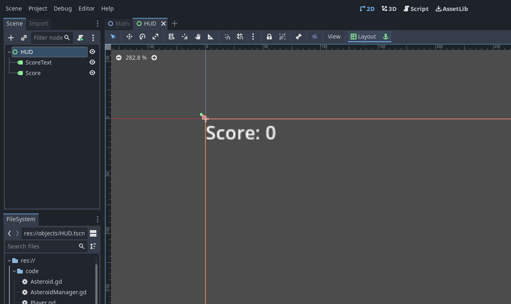
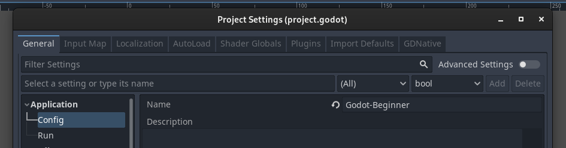
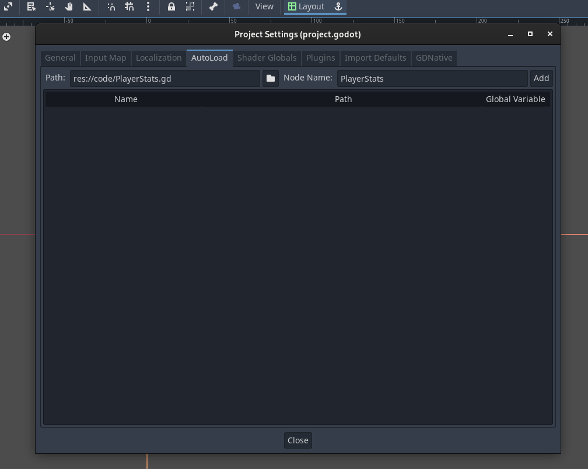
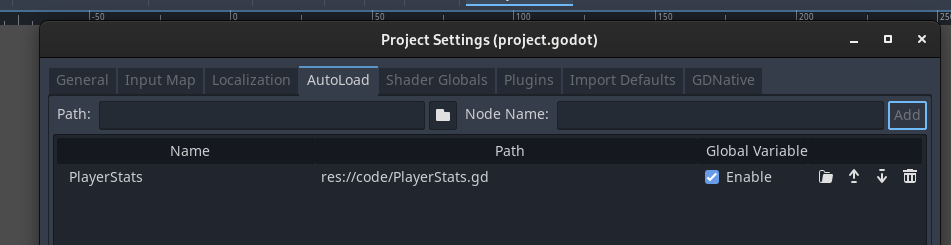
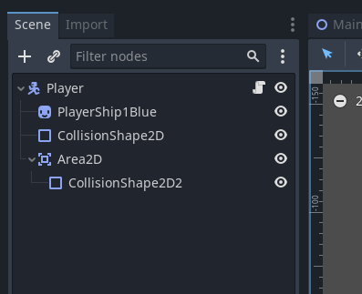

## Introduction

This is part 5 of the tutorial series for making an asteroids style game in
Godot, designed for absolute beginners with little to no experience in
programming.

This article will cover:

1. Making a score counter user interface for the game.
2. Making the score counter increment when the player shoots a meteor.
3. Making the score counter reset when the player ship gets hit by a meteor.

Before going through this article, it is recommended following the steps
outlined in the previous parts of this tutorial series.

## Basics of Godot's UI Nodes

Creating user interfaces in Godot is identical to creating 2D scenes, your user
interface elements are nodes, you have a root node that has child nodes that
form either a single piece of UI or a system, depending on the design decisions
taken. All UI nodes in Godot extend from a derived node of the `Control` node
or extend from the `Control` node directly. The `Control` node implements the
base features that are required in order for a UI node to function. 

## Godot Singleton Nodes

In Godot, when a scene is loaded, the previous scene's information is lost, so
storing the player high score is impossible without the use of singleton nodes.
Singleton nodes exist outside of the scene and can be used to store data that we
want to be persistent. When the player dies and we reset the scene (that is, we
load the same scene again, throwing away the old instance of the scene), the
high score will be lost if it is stored on a normal node. This is why singleton
nodes exist, they are loaded at the very start of the game, and persist
throughout until the game is closed, this allows us to use them to store
information between scenes.

## Making the UI

Creating a UI scene is similar to a 2D scene, on the top-left menu bar of the
editor window, click on `Scene -> New Scene`, however, instead of clicking on
`2D Scene` in the Scene panel, click on `User Interface`, this will create a new
scene, however, instead of the root node being a `Node2D` type of node, it is
now a `Control` node, which is the base building _block_ of UI nodes. Rename the
root node to `HUD` using the Scene panel. Save the scene as `HUD.tscn` in the
`objects` folder.

### Label Node

Godot has a UI node called `Label` that allows you to display information, we
can use it to display our score of destroyed asteroids. Since we want to display
the score we have, and also the text "Score:" to show that the number shown
represents the score, two `Label` nodes will be used for convenience. They can
both be created in the Scene panel, name one `ScoreText`, and name the other one
`Score`. The nodes can then be assigned a default text value by using the
Inspector panel (in the `Text` property). `ScoreText` will have the value
`Score:` assigned. `Score` will have the default value `0` assigned as that is
going to be the default value of the score when the game starts.


At this point, you may notice that the two labels are on top of each other,
that's because they are both currently situated at coordinates (0,0) on the
Control node they are a child of. Drag the number score to the right of the
text score node as shown below.



It is time to create and attach a script so that we can link the score to it. In
the Scene panel, right click on the `code` folder and select `New Script`. For
the script name, choose `HUD.gd` and make sure it inherits `Control` node, this
is because the root node is also a control node. Make sure to drag the script
from the FileSystem panel to the root node that is called `HUD` in the Scene
panel in order to attach the script.

Additionally, make sure to drag the HUD node to the main scene with the player
ship in order for it to be included in the level.

## Incrementing the Score Counter

This section will cover how to display the amount of destroyed asteroids on the
HUD. In order to achieve this, a variable will be created that will track the
number of ships destroyed by the ship. Furthermore, the bullet script will need
to be modified to increment the value of the variable that will be keeping track
of the score, and also to write the HUD code in order to display and update it.

## Singletons in Godot

Firstly, we will create a variable to hold the score of the player ship. We will
use a singleton node to store the variable. Wikipedia describes the singleton
pattern like so:

>In software engineering, the singleton pattern is a software design pattern
>that restricts the instantiation of a class to one "single" instance. This is
>useful when exactly one object is needed to coordinate actions across the
>system.

In short, we only need one variable to score the player score, creating a 
singleton node and storing the variable inside it will allow us to access and
manage it much more easily. In order to create a singleton node, firstly start
by creating a script like normal. Save the script at `code/PlayerStats.gd`. Make
sure the script inherits _Node_. In order to create a singleton node that will
use this script, select `Project -> Project Settings...` in the top left menu
bar.

The project settings window will appear, this window contains various options
that can be used to customize the way the game works and runs. The top part of
the window should have a list of tabs that contain all the options that the
project settings window has to offer in a categorized manner.



Select `AutoLoad`, the window's contents should now change, the window should
now be blank, this is where all the singleton nodes can be declared.



In order to make the `PlayerStats.gd` script be used by a singleton node, click
on `Path` and select the `PlayerStats.gd` script. Then, the _Name_ field should
automatically be populated with the text `PlayerStats`, the value of this field
indicates how this singleton will be referred to inside code. Click on `Add` and
a new singleton will be created that will use the `PlayerStats.gd` script. Make
sure that the checkbox `Enabled` is ticked so that the singleton node is
enabled.



It is now time to declare the variable that will keep track of the score, open
`code/PlayerStats.gd` and write code such that the script looks like this:

```gd
extends Node

var player_score : int = 0
```

This script will need to simply keep track of the `player_score` variable. Next,
the asteroid script will be modified to increment the score. Open
`code/Asteroid.gd` and add the following `PlayerStats.player_score += 1` line in
the `area_entered` function. The script should now look like this:

```gd
extends Area2D

var move_dir : Vector2 = Vector2.ZERO

func _ready() -> void:
    connect("area_entered", area_entered)

func area_entered(area : Area2D) -> void:
    PlayerStats.player_score += 1
    queue_free()

func _physics_process(delta: float) -> void:
    position += move_dir * delta
```

The extra line increments the `player_score` variable in the `PlayerStats`
singleton that was just added in the previous section. This line executes when
the asteroid is to be destroyed. Now, in order to make the HUD update when the
score changes, open `code/HUD.gd` and make the script contain the following:

```gd
extends Control

func _process(delta: float) -> void:
    $Score.text = str(PlayerStats.player_score)
```

This simply sets the `text` property of the `Score` label node in `HUD.tscn` to
constantly update to the current score. So when an asteroid comes in contact
with an object, it deletes itself and increments the player score variable, then
the HUD picks the new value and updates the Score node. You may notice that the
`Score` variable is prefixed with `$` as `$Score`, in Godot, this indicates an
access to a child node, so from the `HUD.tscn`, `$Score` will access the child
`Score` node. It is worth noting that scripts using the `$` prefix only work
with nodes that have those children as nodes, if they do not then the code is
trying to access a node that does not exist and the program will crash.

## Reseting the Score Counter

In order to reset the score counter as soon as a collision occurs, the player
ship's scene will need to be modified by adding an `Area2D` child node, you will
notice that once added, it will display a warning asking for a collision shape
node to be added as a child, the player ship already has a _CollisionShape2D_
node as a child, right clicking on it and selecting _Duplicate_ will create
another node with the same shape. Drag that second node over the _Area2D_ to
parent it to that node. Afterwards, the player scene outline should look like
so:



A few scripts will need to be tweaked in order to account for the player score
being reset.

_Notice that every script shown (aside from `code/PlayerStats.gd` now has a new
line at the very top starting with the keyword `class_name`, what this does is
it labels any node that is using that script with the script name shown. This
feature of GDScript is used in `code/Asteroid.gd` and `code/Player.gd`. This
effectively allows for checking what type of node a certain node is._

### `code/Asteroid.gd`

```gd
class_name Asteroid
extends Area2D

var move_dir : Vector2 = Vector2.ZERO

func _ready() -> void:
    connect("area_entered", area_entered)

func area_entered(area : Area2D) -> void:
    if area.get_parent() is PlayerShip:
        return
    
    if !(area is Asteroid):
        PlayerStats.player_score += 1
    
    queue_free()

func _physics_process(delta: float) -> void:
    position += move_dir * delta
```

The asteroid script's collision checking function (`area_entered`) has been
modified. Upon collision, it now first checks if the node that it has
intersected is the player ship. If it is, then it returns from the method (stops
execution). It then checks if the area is not another asteroid and if it is not,
then it increases the score by one. This also fixes a bug where if an asteroid
were to collide with another asteroid, both asteroids would count as a point and
hence, increment the score by 2. The final action is to destroy the asteroid.

### `code/Player.gd`

```gd
class_name PlayerShip
extends CharacterBody2D

@export var turn_speed : float = 3

@export var fire_cooldown : float = 0.75
var fire_cooldown_left : float = 0
const bulletPackedScene : PackedScene = preload("res://objects/ShipBullet.tscn")

func _ready() -> void:
    $Area2D.connect("area_entered", area_entered)

func area_entered(node : Area2D) -> void:
    if !(node is ShipBullet):
        PlayerStats.player_dead()

...
```

The player ship script now adds the extra method `area_entered`, what this
method does is if an `Area2D` node intersects with the player ship's `Area2D`
node then it first checks if the node is not a ship bullet and then calls the
`player_dead` method from the `PlayerStats`. If it is a ship bullet, then it is
ignored because the ship bullets initially intersect with the player ship's area
2D, so that is a check to stop the player ship from dying by firing a bullet
(which would be pretty funny but would make the game unplayable).

### `code/PlayerStats.gd`

```gd
extends Node

var player_score : int = 0

func player_dead() -> void:
    PlayerStats.player_score = 0
    get_tree().reload_current_scene()
```

A new method has been added called `player_dead` that when invoked will cause
the level to reset, along with the player score variable. 

### `code/ShipBullet.gd`

```gd
class_name ShipBullet
extends Area2D

var speed : float = 500

# Called every frame. 'delta' is the elapsed time since the previous frame.
func _process(delta: float) -> void:
    position += Vector2(speed * delta, 0).rotated(rotation)
```

The player ship bullet script just adds a class name for this script. There are
other scripts that have a class name assigned.

## Running the Game

The game should now be a fully featured asteroids clone where asteroids come
from outside the screen and the player has to shoot them. If the player gets hit
with an asteroid, then the scene reloads and the game resets.

## Challenges

Here are some challenges to return to when you are more experienced with Godot:

* Add a high-score counter, you will notice that half the work for implementing
this has already been done (by creating the `PlayerStats.gd` singleton script).
* Make the player ship move forwards and backwards with the up and down arrow
keys.

## Project Files

The final project files of this tutorial series can be found on
[GitHub](https://github.com/Yiannis128/godot-asteroids/tree/part-5).

## Useful Links

1. [Godot UI Basics](https://docs.godotengine.org/en/stable/getting_started/step_by_step/ui_introduction_to_the_ui_system.html#)
2. [Singleton Nodes](https://docs.godotengine.org/en/stable/getting_started/step_by_step/singletons_autoload.html)

## What's Next

Part 5 took a brief look into the user interface system, a lot of topics that
may not have been fully explained, it is recommended that you read the articles
in Useful Links in order to better understand them.

---

[_You are at the end of this journey, but a bigger one has just begun!_](https://docs.godotengine.org/en/stable/)
